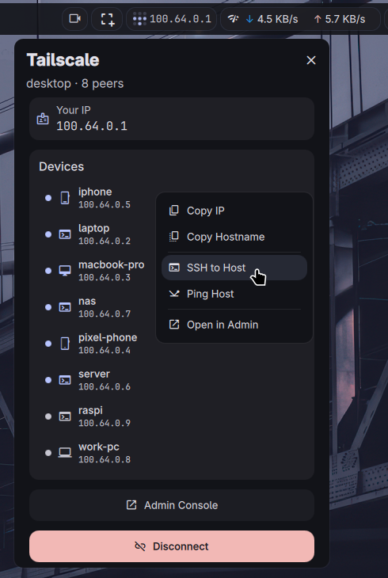

# Tailscale Plugin

A Tailscale VPN manager plugin for [DankMaterialShell](https://github.com/AvengeMedia/DankMaterialShell). Monitor connection status, browse peers, and manage your tailnet from the bar.

> **Disclaimer:** This is a community-created plugin built on top of the Tailscale CLI tool. It is not affiliated with, endorsed by, or officially connected to Tailscale Inc.

## Requirements

- [Tailscale](https://tailscale.com/) installed and authenticated
- `wl-copy` (from `wl-clipboard`) for clipboard operations
- A terminal emulator for SSH/Ping actions (configured in settings)

## Credits

- [Cooper Glavin](https://github.com/cglavin50) - Original DMS Tailscale widget and repo
- [nineluj](https://github.com/nineluj) - [Noctalia Tailscale plugin](https://github.com/noctalia-dev/noctalia-plugins/tree/main/tailscale) with peer list, panel UI, and settings architecture
- [hxreborn](https://github.com/hxreborn) - DMS port, context menu, visual polish

## License

MIT
